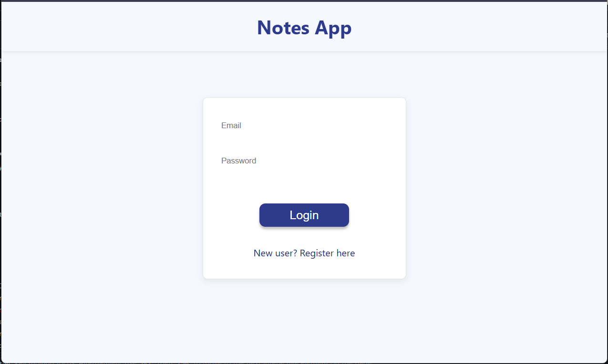
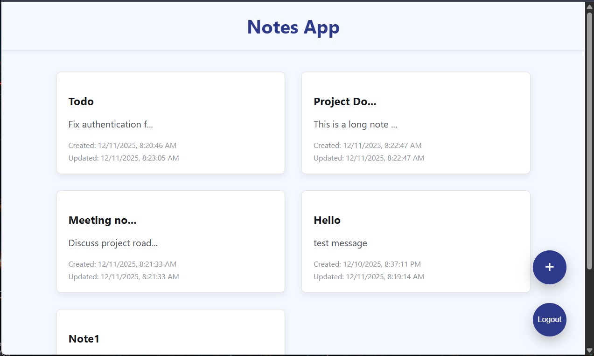
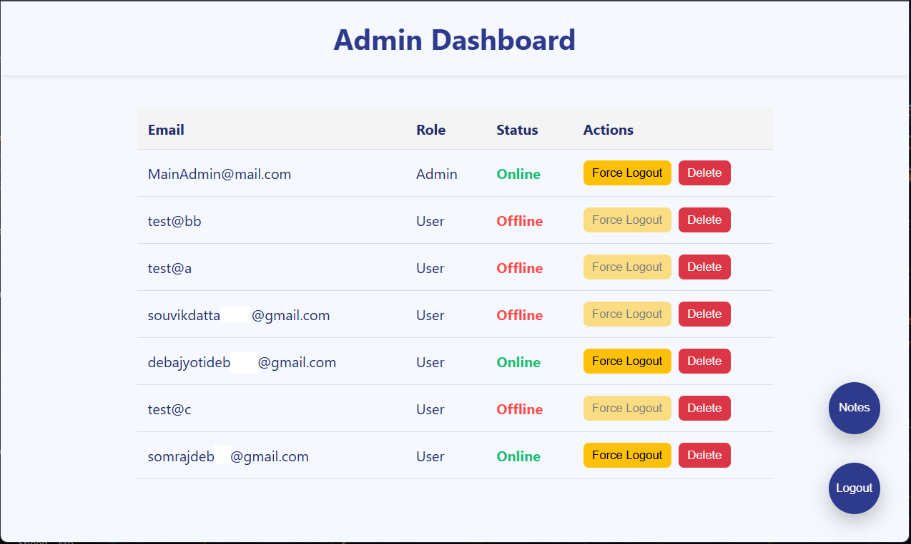

# Full Stack Notes App (FastAPI + React + PostgreSQL + Docker + Traefik)

This is a fully containerized full-stack Notes Application built using:

- **FastAPI** (Backend)
- **React + Vite** (Frontend)
- **PostgreSQL** (Database)
- **Alembic** (Migrations)
- **Docker + Docker Compose** (Environment Orchestration)
- **Traefik** (Reverse Proxy)

Live Deployment: https://notes-app.rajsekharde.com

## Architecture Diagram:


## Login Page:


## Notes Page:


## Admin Dashbaord:


## Features
- User authentication (with JWT tokens + Cookies)
- Create / Read / Update / Delete notes
- Persistent PostgreSQL storage
- Routing & HTTPS using Traefik
- Dockerized frontend, backend, database
- Orchestration using Docker Compose
- Automatic Alembic migrations
- Deployed using AWS EC2 + CloudFlare DNS

## Running the App (Local)

### 1. Install Docker & Docker Compose  
Make sure Docker Desktop is running.

### 2. Start the whole stack

Create a .env file in root project folder.
Add the following variables:
```bash
POSTGRES_USER=postgres
POSTGRES_PASSWORD=12345
POSTGRES_DB=db

DB_HOST=notes_db
DB_PORT=5432

SECRET_KEY=any_random_string

ACCESS_TOKEN_EXPIRE_MINS=10
REFRESH_TOKEN_EXPIRE_DAYS=7

ADMIN_PASSWORD=12345 # Use it to login using admin email

DATABASE_URL=postgresql+psycopg2://postgres:12345@db:5432/notes_db

FRONTEND_URL=http://localhost

BACKEND_PORT=8000
```

Then run in root folder terminal:
```bash
docker compose up --build -d
```

### 3. Access the App

Frontend: http://localhost:80

Backend API Docs: http://localhost:80/api/docs

Healthcheck: http://localhost:8080/api/health

Traefik Dashboard: http://localhost:8080

Shut down the App & containers using:
```bash
docker compose down
```

## Deploying to AWS EC2 Instance:

Launch an EC2 instance with Ubuntu 24.04 AMI

Add a new DNS record to your domain:
```bash
Type: A
Content: <Public IPv4 address of EC2 Instance>
Cloudflare Proxy enabled

SSL/TLS mode set to Flexible
```

SSH into the instance

Install docker, docker-compose, git

Clone GitHub repository to EC2 instance:
```bash
git clone https://github.com/rajsekharde/Notes-App.git
cd Notes-App
```

Create .env file:
```bash
nano .env
```

Add the same environment variables mentioned in the beginning

Add your hostname to the backend and frontend labels in docker-compose.yml

Build docker containers:
```bash
docker compose up --build -d
```

Open your hostname in a browser

Check status of containers & logs:
```bash
docker ps
docker compose logs
```

To stop the containers:
```bash
docker compose down
```

## Project Structure
```bash
Notes-App
├── backend
│   ├── alembic
│   │   ├── env.py
│   │   ├── README
│   │   └── versions
│   ├── alembic.ini
│   ├── app
│   │   ├── auth_utils.py
│   │   ├── core
│   │   │   └── config.py
│   │   ├── crud.py
│   │   ├── database.py
│   │   ├── main.py
│   │   ├── models.py
│   │   ├── routes
│   │   │   ├── auth.py
│   │   │   └── notes.py
│   │   ├── schemas.py
│   │   └── security.py
│   ├── Dockerfile
│   ├── requirements.txt
│   └── tests
│       ├── conftest.py
│       ├── test_auth.py
│       └── test_notes.py
├── docker-compose.base.yml
├── docker-compose.yml
├── frontend
│   ├── Dockerfile
│   ├── index.html
│   ├── nginx.conf
│   ├── package.json
│   ├── README.md
│   ├── src
│   │   ├── App.css
│   │   ├── App.jsx
│   │   ├── auth
│   │   │   └── auth.js
│   │   ├── components
│   │   │   ├── CreateNoteModal.jsx
│   │   │   ├── EditNoteModal.jsx
│   │   │   ├── NoteModal.css
│   │   │   └── NoteModal.jsx
│   │   ├── index.css
│   │   ├── main.jsx
│   │   └── pages
│   │       ├── AdminDashbaord.jsx
│   │       ├── Login.jsx
│   │       ├── Notes.css
│   │       ├── Notes.jsx
│   │       └── NotesTemp.jsx
├── media
├── README.md
├── traefik.dev.yml
└── traefik.prod.yml
```

## Technologies

FastAPI

React (Vite)

PostgreSQL

SQLModel

Alembic

Traefik

Docker

AWS

## Future Plans

CI/CD with GitHub Actions

## License

MIT
